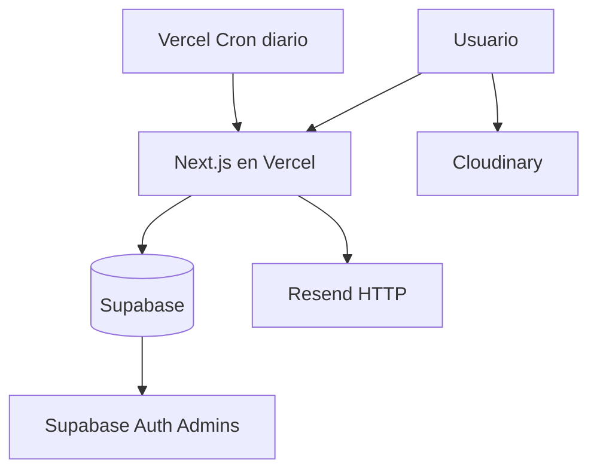

# SYSTEM_CONTEXT.md

## 🧠 Propósito de este Archivo
Este archivo es la **Memoria Central y Contexto del Sistema** para cualquier Inteligencia Artificial o desarrollador. Describe **CÓMO** y **POR QUÉ** funciona el sistema CEUTA.
**Regla:** Si modificas la lógica central, arquitectura o flujos, DEBES actualizar este archivo.

---

## 🏗 Arquitectura y Tech Stack

**Core:**
*   **Framework:** Next.js 16 (App Router).
*   **Lenguaje:** TypeScript.
*   **Estilos:** TailwindCSS (v4) + Shadcn/UI.
*   **Base de Datos & Auth:** Supabase (PostgreSQL) — plan gratuito.
*   **Storage:** Cloudinary (comprobantes e imágenes).
*   **Emails:** Resend HTTP (primario). SMTP/Nodemailer solo como fallback. Templates en DB.
*   **Cron:** Vercel Cron diario (Hobby: máximo 1 corrida/día). GitHub Actions horario **desactivado**.
*   **Deploy:** Vercel (Hobby).
*   **Pagos:** Mercado Pago (preference API) + dLocal (Argentina) + transferencia con comprobante.

**Diagrama de Arquitectura:**


---

## 💾 Base de Datos (14 Tablas)

El modelo de datos es relacional y centralizado en Supabase.

| Tabla | Descripción Crítica | Detalles Importantes |
|-------|---------------------|----------------------|
| `cursos` | Catálogo educativo | Precios, fechas, descuentos por cupo, galería, video_url, sync web vieja (`url_web_vieja`). |
| `inscriptos` | Usuarios (Leads/Alumnos) | Centraliza todo. `access_token` (magic link), `estado`, `comprobante_url`, `monto_pago` (precio congelado). |
| `docentes` | Equipo docente | FK desde `cursos.docente_id`. |
| `programa_clases` | Temario de cada curso | FK a `cursos`. |
| `faqs_cursos` | Preguntas frecuentes | `curso_id` NULL = global. |
| `descuentos` | Códigos promocionales | Validación en backend. |
| `email_templates` | Plantillas HTML/Texto | DEFINEN el contenido. No hardcodear textos de secuencia. |
| `scheduled_emails` | Cola de envío | 24h, 72h, 7d. `pending` → `sent` / `cancelled` / `failed`. |
| `email_logs` | Historial de envíos | Auditoría. FK a `inscriptos`. |
| `testimonios` | Testimonios de alumnos | Landing. |
| `configuracion` | Config del sistema | Pares clave/valor (email contacto, datos bancarios). |
| `analytics_events` | Tracking de visitas | session_id, page_path, UTMs. |
| `embeddings_cursos` | Embeddings vectoriales | Búsqueda semántica. |
| `historial_chats` | Historial de chats | Bot WhatsApp. |

**Nota:** Los comprobantes de pago se guardan como URL en `inscriptos.comprobante_url` (no hay tabla de comprobantes).

---

## 🔄 Flujos Críticos de Negocio

### 1. Inscripción (Wizard de 3 Pasos + Perfil Post-Pago)
El componente `EnrollmentModal.tsx` es el corazón de la conversión.
1.  **Paso 1 (Contacto):** Nombre/Email/Tel. Crea registro (`estado: 'contacto'`). Genera `access_token`. Envía email `confirmacion` y programa la secuencia.
2.  **Paso 2 (Pago):** Tipo (Total/Cuota o Seña) y método (Transferencia / MercadoPago / dLocal / Efectivo). Código de descuento opcional.
3.  **Paso 3 (Confirmación):** Instrucciones + subida de comprobante.
4.  **Post-Upload (Perfil):** `CompleteProfileForm` (Cédula, Edad, Departamento, Dirección, Cómo se enteró).

#### 1.b. Puntos de entrada al wizard (`CourseEnrollProvider`) — 02/09/2026

Todo lo que puede abrir el wizard en `/cursos/[slug]` cuelga de **un único provider**
(`components/cursos/CourseEnrollContext.tsx`). El contexto y los tipos viven aparte,
en `courseEnrollStore.ts`, para que el provider pueda importar la barra y el modal
sin ciclo de imports.

Puntos de entrada, todos contra **la misma instancia de `EnrollmentModal`**:

| Punto | Componente | Dónde aparece |
|---|---|---|
| CTA de la sidebar | `EnrollButton` | Pantalla ~1,1 (mobile) / sidebar sticky (desktop) |
| Barra fija al pie | `CourseStickyCta` | Desde que el CTA de la sidebar sale de pantalla |
| Cierre tras el programa | `InlineEnrollCta` | Después de `ProgramaSection` |
| Cierre tras testimonios | `InlineEnrollCta` | Después de los testimonios |
| Cierre tras FAQ | `InlineEnrollCta` | Después de `FAQSection` |

**Reglas que no hay que romper:**

1.  **Un solo modal y un solo precio.** Antes el estado del modal vivía en
    `EnrollButton` y la modalidad (híbrido / 100% online) en `CourseSidebarClient`.
    Con varios CTA en la página eso daba dos instancias y dos precios distintos:
    la barra podía decir $5.000 y la sidebar $2.500 según qué modalidad estuviera
    elegida. El precio se calcula **una sola vez** en el provider con
    `calcularDescuento`, el mismo helper que usa `PriceDisplay`.
2.  **La barra se muestra por `getBoundingClientRect`, no por `IntersectionObserver`.**
    IO se entrega desde el pipeline de render: en pestañas de fondo o webviews que
    no componen frames puede no dispararse nunca y la barra quedaría escondida para
    siempre.
3.  **La barra publica su alto en `--ceuta-cta-h`.** Los elementos flotantes
    (`WhatsAppButton`, `InscripcionBanner`) llevan la clase `.ceuta-floating-offset`
    (definida en `globals.css`) y se corren hacia arriba con `translateY`. Si se
    agrega otro elemento fijo al pie, tiene que llevar esa clase.
4.  **La barra va en `z-40`, debajo del overlay del `Dialog` (`z-50`), y además se
    oculta con el modal abierto.**
5.  **Nada de urgencia inventada.** La única cuenta regresiva de la barra sale de
    `fecha_inicio` ("Empieza en N días", solo si faltan 21 días o menos). Las fechas
    se arman con los componentes Y-M-D en hora local, igual que `formatearFechaLarga`:
    `new Date('2026-09-10')` es medianoche UTC y en UTC-3 descuenta un día.

⚠️ **Ojo con `descuento_cupos_usados`:** `calcularDescuento` exige
`cuposTotales > 0` **y** `cuposDisponibles > 0` para aplicar el descuento. Si el
contador de cupos usados alcanza al total, **el descuento se apaga solo** y el
precio salta al de lista en toda la página. Hoy los 10 cursos tienen
`cupos_totales = 10` y `cupos_usados = 0`.

### 2. Portal de Usuario ("Mi Inscripción")
*   **Acceso:** Magic Link (`/mi-inscripcion/[token]`).
*   **Seguridad:** El `token` (32 chars hex) es la llave. No regenerar salvo pedido explícito.
*   **UX:** Cookie `ceuta_inscripciones` solo para el banner "Retomar inscripción".

### 3. Pagos y Verificación
*   **Transferencia:** Usuario paga → sube foto → admin verifica.
*   **Mercado Pago:** Preference API (`/api/mercadopago/preference`).
*   **dLocal:** Cursos Argentina (`/api/dlocal/*`).
*   **Estados reales de `inscriptos.estado`:**
    *   `contacto`: Solo paso 1.
    *   `pago_pendiente`: Eligió método, no subió comprobante.
    *   `pago_a_verificar`: Subió comprobante.
    *   `verificado`: Admin aprobó.
    *   `rechazado`: Admin rechazó.
    *   `cancelado`: Baja.
    *   Legacy (no usar en código nuevo): `pagado`, `confirmado`, `primer_contacto`, `segundo_contacto`.

### 4. Sistema de Emails
*   **Motor:** `emailService.ts` → intenta Resend; si Resend rechaza (modo prueba / sin dominio), cae a Gmail SMTP. GitHub Actions **no** envía mails a alumnos.
*   **De:** `EMAIL_FROM`. Sin dominio verificado en Resend, solo se puede mandar al mail de la cuenta Resend, desde `onboarding@resend.dev`.
*   **Secuencia:**
    1.  `confirmacion` (inmediato, 0h) en `/api/inscripcion/preinscripcion`.
    2.  `recordatorio_24h` (24h).
    3.  `urgencia_72h` (72h).
    4.  `ultima_oportunidad_7d` (7 días).
*   **Stop de recordatorios:** se cancelan al subir comprobante (`pago_a_verificar`) y en `verificado` / `rechazado` / `cancelado`. El cron también saltea esos estados.
*   **Cron:** Vercel llama `GET /api/cron/send-scheduled-emails` una vez por día (`0 12 * * *`) con `Authorization: Bearer CRON_SECRET`. En Hobby no hay cron horario. Un atraso de hasta ~24h en recordatorios es esperado y aceptable.
*   **GitHub Actions:** el workflow horario se desactivó. Nunca tuvo secretos `APP_URL`/`CRON_SECRET`, falló **2.264 veces** y GitHub maileaba cada fallo al dueño del repo. No reactivar el `schedule:` sin esos secretos.
*   **Vercel + SMTP:** no es el camino. Las funciones serverless cortan conexiones SMTP; Gmail además bloquea IPs de datacenter. Por eso Resend (HTTP) es el primario. Nunca disparar `sendEmail` en fire-and-forget: hay que `await` antes de responder.
*   **Prueba:** `/admin/email-templates` → "Enviar correo de prueba" (`POST /api/admin/email-test`).
*   **Guía operativa:** `como implementar/CONFIGURAR_EMAIL.md`.

### 5. Sincronización con Web Vieja ("Modo Hacker")
*   **Servicio:** `syncViejaWeb.ts` hace POST al formulario PHP de ceuta.org.uy en cada preinscripción.
*   **Config:** `cursos.url_web_vieja`. Si está vacío, no sincroniza.

### 6. Sistema de Precios, Cuotas y Descuentos
*   **Motor:** `discountUtils.ts` (`calcularDescuento`, `formatearPrecio`, `calcularPrecioCuota`).
*   **Componente UI:** `PriceDisplay.tsx` unifica la visualización (cuotas, tachado, ahorro, cupos y fecha límite) de forma reactiva y determinista.
*   **Base de datos:** Columnas en `cursos` (`precio`, `cantidad_cuotas`, `descuento_porcentaje`, `descuento_cupos_totales`, `descuento_cupos_usados`, `descuento_etiqueta`, `descuento_fecha_fin`, etc.).
*   **Guía operativa maestra para promociones:** `docs/SISTEMA_PRECIOS_Y_DESCUENTOS.md`.

---

## 🛡️ Invariantes y Reglas de Oro (DO NOT BREAK)

1.  **Templates en DB:** NUNCA hardcodear el cuerpo de la secuencia de emails en TypeScript. Usar `processTemplate` con `email_templates`. Excepción: mails de sistema one-off (`comprobante_recibido`, test admin) pueden usar `generateEmailHtml`.
2.  **Validación de Precio:** El frontend es solo visual. El precio final SIEMPRE se recalcula/valida en backend.
3.  **Magic Links:** El `access_token` en `inscriptos` es sagrado. No regenerar a menos que se pida explícitamente.
4.  **Admin Client:** `createAdminClient()` (service role) SOLO en `/api/*` o Server Actions protegidas. NUNCA al cliente.
5.  **Storage:** Comprobantes → Cloudinary `ceuta/comprobantes`.
6.  **Imágenes de cursos:** Portadas/heroes → `ceuta/cursos/portadas` y `ceuta/cursos/heroes`. Galerías = array de URLs en `cursos.galeria`.
7.  **Email en Vercel:** `await` el envío. No fire-and-forget. Preferir Resend sobre SMTP.
8.  **Stop de nurturing:** si el estado deja de ser lead de pago pendiente, cancelar `scheduled_emails` pendientes.

---

## 📂 Mapa del Proyecto

```
/src
  /app
    /api                 -> Backend (Inscripción, Admin, Cron)
      /cron/send-scheduled-emails
      /admin/email-test  -> GET estado del proveedor, POST prueba
    /admin               -> Panel de Control (Protected)
    /mi-inscripcion      -> Portal Usuario (Magic Link)
    /cursos/[slug]       -> Página pública de cada curso
  /components
    /cursos/EnrollmentModal.tsx  -> 🔴 Wizard 3 pasos (instancia ÚNICA, la monta el provider)
    /cursos/CourseEnrollContext.tsx -> 🔴 Provider: modal único + precio único + barra fija
    /cursos/courseEnrollStore.ts -> Contexto y tipos (aparte, para cortar el ciclo de imports)
    /cursos/CourseStickyCta.tsx  -> Barra de inscripción fija al pie
    /cursos/InlineEnrollCta.tsx  -> CTA repetido dentro del contenido
    /cursos/CompleteProfileForm.tsx
  /lib
    /services/emailService.ts    -> Envíos (Resend / SMTP)
    /services/emailTransport.ts  -> Resolución del proveedor
    /services/syncViejaWeb.ts
    /utils/templateProcessor.ts
    /utils/tokens.ts
/supabase
  /migrations
```

---

## 🚦 Estado Actual (Agosto 2026)
*   Deploy en **Vercel Hobby**. Supabase y Resend también en plan gratuito.
*   Email: código listo para Resend. **Requiere** `RESEND_API_KEY` (+ dominio verificado para mandar a alumnos) en Vercel. Ver `como implementar/CONFIGURAR_EMAIL.md`.
*   Cron de recordatorios: **Vercel diario**. GitHub Actions horario desactivado (era la fuente de miles de mails de error).
*   Subida de archivos: **Cloudinary**.
*   Pagos: Mercado Pago + dLocal (AR) + transferencia.
*   Sincronización con web vieja (ceuta.org.uy) implementada.
